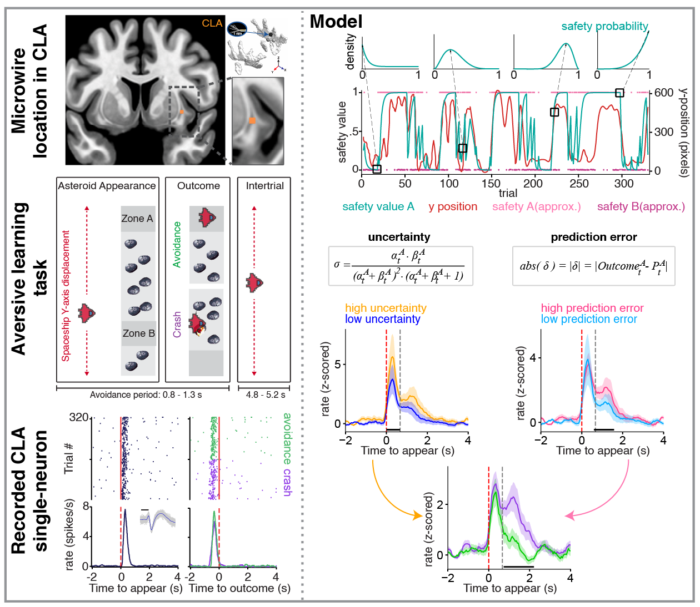

# Human Claustrum Neurons Encode Uncertainty and Prediction Errors During Aversive Learning

This repository contains analysis code for the manuscript:

**Human claustrum neurons encode uncertainty and prediction errors during aversive learning**

The project analyzes rare human intracranial single-neuron recordings from the claustrum, anterior cingulate cortex, and amygdala during aversive learning. The main goal is to test whether human claustrum neurons encode computational variables related to uncertainty and prediction errors.

> **Repository note:**  
> The official Damisah Lab repository is available at:  
> https://github.com/damisahlab/claustrum-uncertainty-surprise  
>
> This personal repository is maintained by Rodrigo Dalvit Carvalho da Silva as a public reproducibility and portfolio copy of the analysis workflow.

---

## Overview

The claustrum is a thin, deep-brain structure that has been proposed to contribute to the coordination of distributed neural systems. Direct human single-neuron recordings from the claustrum are rare.

In this study, single-neuron activity was recorded from the human claustrum, anterior cingulate cortex, and amygdala during aversive learning. The analyses examine task-related neuronal responses and test whether neuronal activity encodes computational variables such as uncertainty and prediction errors.

The repository includes MATLAB, Python, and R scripts used for figure generation, statistical analysis, mutual information analysis, permutation testing, and visualization.

---

## Study summary

Single-neuron activity was recorded from three brain regions:

- **CLA** — claustrum  
- **ACC** — anterior cingulate cortex  
- **AMY** — amygdala  

The analysis shows that CLA and ACC neurons exhibit structured task-related responses, whereas AMY neurons show weaker modulation in this task context. CLA neurons encode uncertainty and prediction errors, providing cellular-level evidence that the human claustrum participates in predictive processing during adaptive behavior.



---

## Repository structure

```text
.
├── Codes/                                      # Main analysis scripts
├── Data/                                       # Publicly available data files used by the scripts
├── utilities/                                  # Helper functions for MATLAB analyses
├── NeuroPair/                                  # Python code for recurrent graph neural network with attention
├── CITATION.cff                                # Citation metadata
├── LICENSE                                     # Repository license
├── cla_uncertainty_pe.png                      # Project summary image
└── README.md
